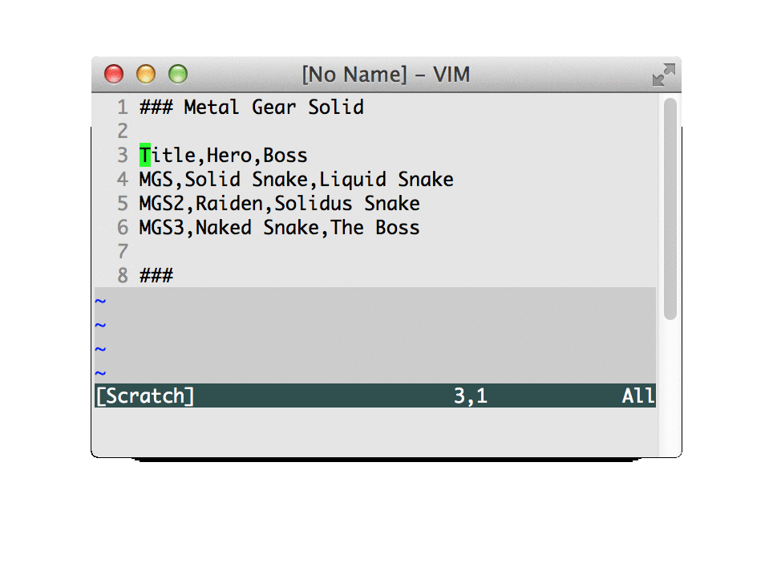
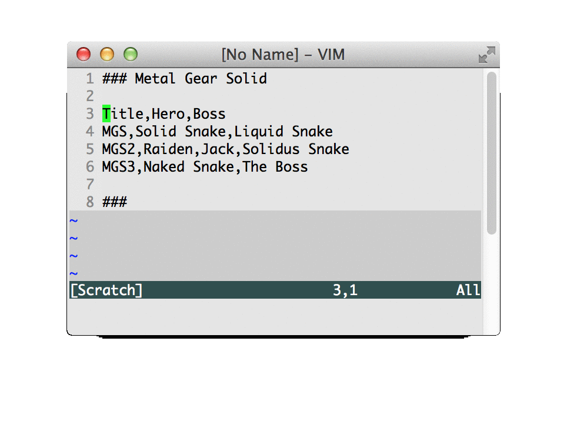
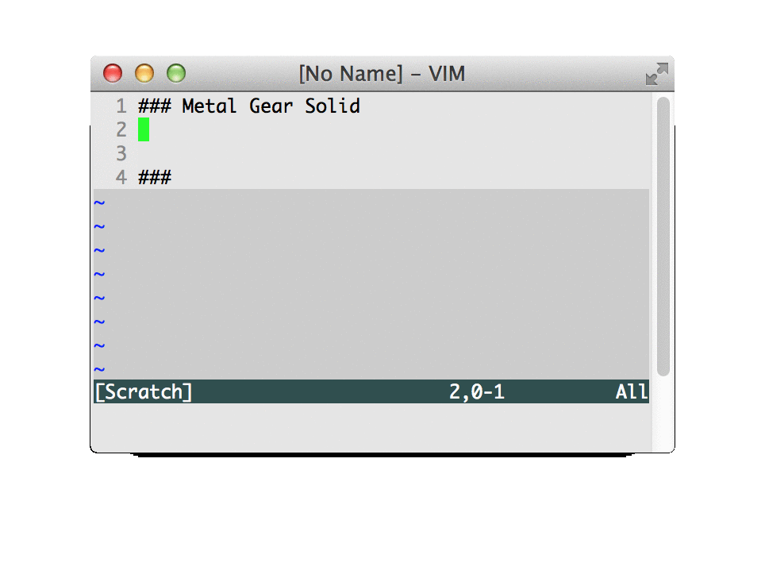
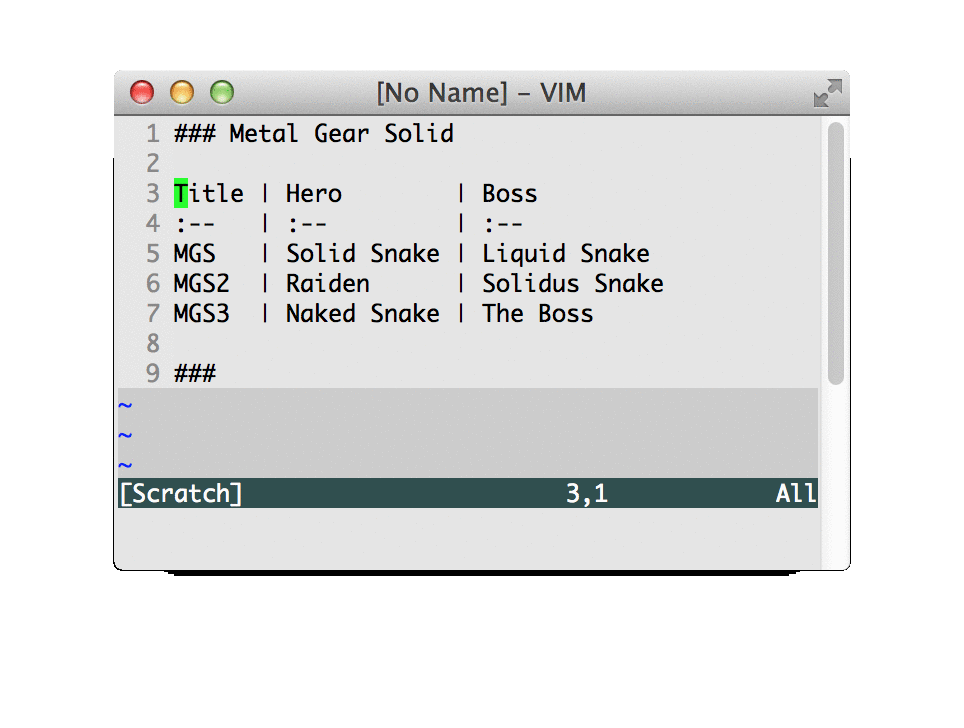

# table-converter
Vim上で`csv`と`markdownのテーブル記法`の相互変換を行うVimプラグイン、および変換APIです

## 初期設定
### スクリプト取得
`$ git clone https://github.com/tenshiPure/table-converter.git`

### vimの設定ファイル(~/.vimrc)に設定を追記
```VimScript:~/.vimrc
let g:table_converter_root_path = '/path/to/dir/vim/table-converter'
source /path/to/dir/vim/table-converter/vim/commands.vim
```

## 使い方（Vimプラグイン）
### ToMarkdown
範囲選択中に`:ToMarkdown`と入力すると、現在編集しているファイルの一部を`csv`から`markdown`に変換して書き換えます



選択した行のカラム数がずれている等のエラー時には書き換えは行われません



+ このエラー時の挙動は他のコマンドも全て同様です

### ShowMarkdown
`ToMarkdown`と違い、変換結果は表示されるだけです


+ `ShowMarkdown`で編集と確認を繰り返し、`ToMarkdown`を最後に実行すると良いです

### AppendMarkdownFromFile
`csv`ファイルを読み込み、カーソルの位置に`markdown`を展開します

```
# デモ用の入力ファイル
$ cat ../samples/valid.csv
Title,Hero,Boss
MGS,Solid Snake,Liquid Snake
MGS2,Raiden,Solidus Snake
MGS3,Naked Snake,The Boss
```



+ ある程度の大きさの新たなテーブルを作成する場合にはぜひご利用ください

### ToCsv
`ToMarkdown`の逆を行います



+ `csv`に変換するのは何らかの表計算ソフトで編集し直すためだと思われるので、縦揃えはされず隙間はつめて出力されます
+ 縦の揃っていない`markdown`に`ToCsv`と`ToMarkdown`を実行すると縦が揃います

### WriteCsvToFile
選択した範囲の`markdown`を`csv`に変換し、ファイルに書き出します


```
# デモ用の出力ファイル
$ cat xxx/out.csv
Title,Hero,Boss
MGS,Solid Snake,Liquid Snake
MGS2,Raiden,Solidus Snake
MGS3,Naked Snake,The Boss
```

+ この例では出力先はマスクしていますが、実際にはフルパスが表示されます
+ `AppendMarkdownFromFile`とあわせてご利用ください

## 使い方（コマンドラインツール）
### to-markdown.py
標準入力で改行を含む文字列を受け取り、標準出力します

```
# デモ用の入力ファイル
$ cat valid.csv
Title,Hero,Boss
MGS,Solid Snake,Liquid Snake
MGS2,Raiden,Solidus Snake
MGS3,Naked Snake,The Boss

# 実行
$ cat valid.csv | python to-markdown.py
Title | Hero        | Boss         
:--   | :--         | :--          
MGS   | Solid Snake | Liquid Snake 
MGS2  | Raiden      | Solidus Snake
MGS3  | Naked Snake | The Boss     
```

### to-csv.py
標準入力で改行を含む文字列を受け取り、標準出力します

```
# デモ用の入力ファイル
$ cat valid.md
Title | Hero        | Boss         
:--   | :--         | :--          
MGS   | Solid Snake | Liquid Snake 
MGS2  | Raiden      | Solidus Snake
MGS3  | Naked Snake | The Boss     

# 実行
$ cat valid.md | python to-csv.py
Title,Hero,Boss
MGS,Solid Snake,Liquid Snake
MGS2,Raiden,Solidus Snake
MGS3,Naked Snake,The Boss
```

## 環境
       | version
:--    | :--    
Python | 2.7.5  
Vim    | 7.4.22 
Zsh    | 5.0.2  
